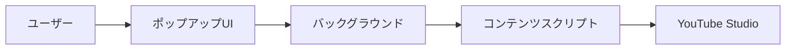
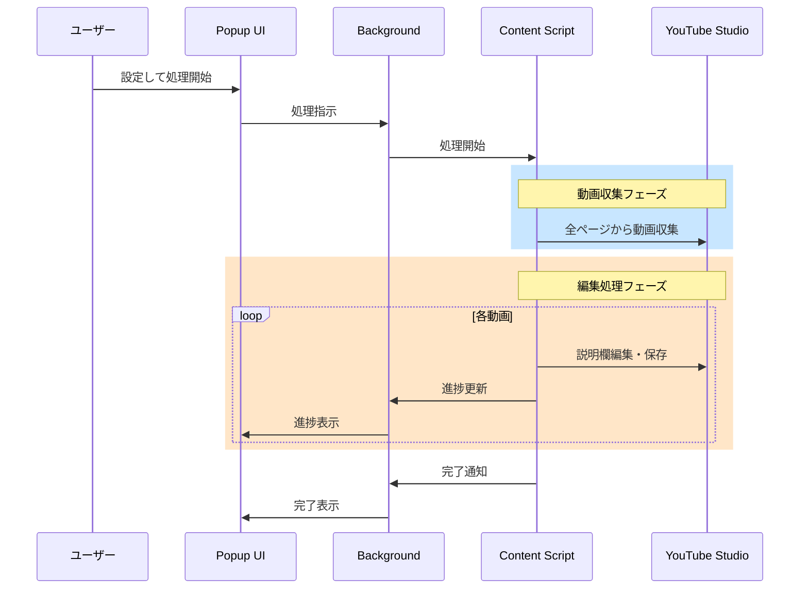
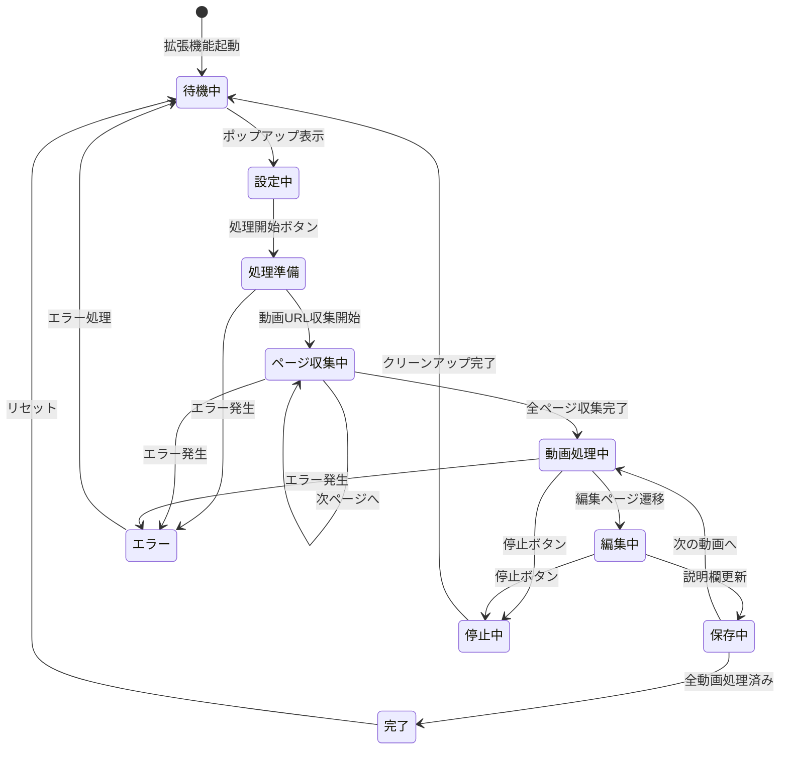
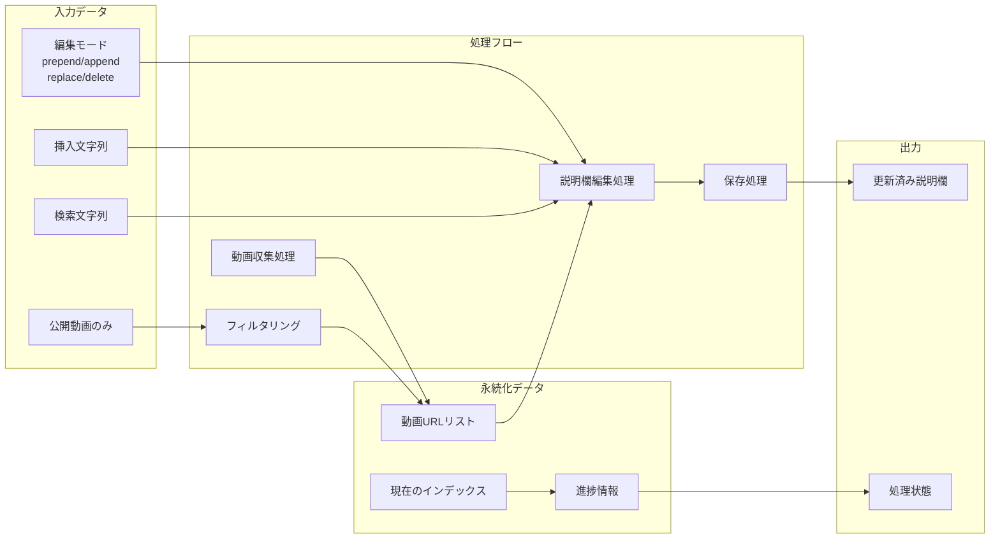
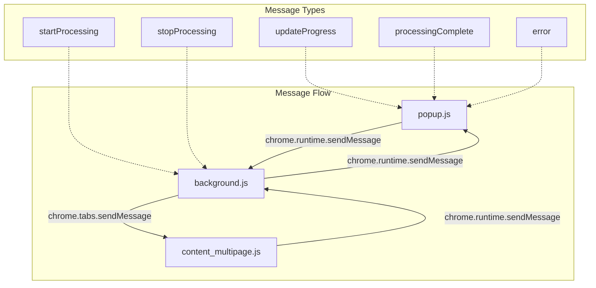
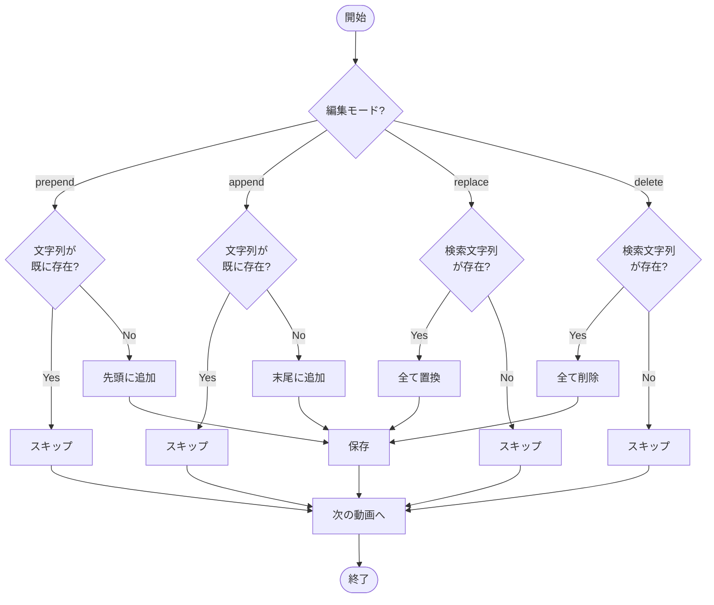

# YouTube動画説明欄自動編集ツール - システムドキュメント

## 概要
このChrome拡張機能は、YouTube Studioで管理している複数の動画に対して、説明欄の一括編集を自動化するツールです。

## 1. 全体構成図



## 2. 全体シーケンス図



## 3. 状態遷移図



## 4. データフロー図



## 5. コンポーネント間通信図



## 6. 編集モード動作フロー



## 主要機能

### 1. 複数ページ対応
- YouTube Studioの全ページから動画を自動収集
- ページネーションを自動的に処理

### 2. 編集モード
- **先頭に追加 (prepend)**: 説明欄の最初に文字列を追加
- **末尾に追加 (append)**: 説明欄の最後に文字列を追加
- **置換 (replace)**: 特定の文字列を別の文字列に置換
- **削除 (delete)**: 特定の文字列を削除

### 3. フィルタリング
- 公開動画のみを処理対象にすることが可能
- 限定公開・非公開動画を除外

### 4. 進捗管理
- リアルタイムで処理進捗を表示
- ページリロードしても処理を継続

## ストレージ設計

### LocalStorage
```javascript
{
  "yt_video_urls": "[{href, title}, ...]",  // 処理対象動画リスト
  "yt_current_index": "0",                   // 現在処理中のインデックス
  "yt_auto_processing": "true",              // 自動処理中フラグ
  "yt_only_public": "true"                   // 公開動画のみフラグ
}
```

### Chrome Storage
```javascript
{
  "isProcessing": true,        // 処理中フラグ
  "progress": 0,               // 現在の進捗
  "total": 0,                  // 総動画数
  "editMode": "prepend",       // 編集モード
  "insertText": "...",         // 挿入文字列
  "searchText": "...",         // 検索文字列
  "savedEditMode": "...",      // 保存された編集モード
  "savedInsertText": "...",    // 保存された挿入文字列
  "savedSearchText": "..."     // 保存された検索文字列
}
```

## セキュリティ考慮事項

1. **権限の最小化**: 必要最小限の権限のみを要求
2. **DOM操作の安全性**: `execCommand`を使用してXSS攻撃を防止
3. **URL検証**: YouTube Studio以外のサイトでは動作しない

## トラブルシューティング

### よくある問題と解決策

1. **動画が検出されない**
   - YouTube Studioのコンテンツページで実行しているか確認
   - ページが完全に読み込まれているか確認

2. **説明欄が更新されない**
   - 編集権限があるか確認
   - YouTube側のUI変更に対応が必要な可能性

3. **処理が途中で止まる**
   - ブラウザのタブを閉じていないか確認
   - ネットワーク接続を確認

## 開発者向け情報

### ファイル構成
```
/chrome_extension_youtube_auto_edit_description/
├── manifest.json           # 拡張機能設定
├── popup.html             # ポップアップUI
├── popup.js               # ポップアップロジック
├── popup.css              # ポップアップスタイル
├── content_multipage.js   # コンテンツスクリプト（複数ページ対応）
├── content_simple.js      # コンテンツスクリプト（単一ページ）
└── background.js          # バックグラウンドサービスワーカー
```

### デバッグ方法
1. Chrome拡張機能ページで「デベロッパーモード」を有効化
2. 「サービスワーカー」をクリックしてバックグラウンドコンソールを表示
3. YouTube Studioページで開発者ツールを開いてコンテンツスクリプトのログを確認

### テスト項目
- [ ] 単一ページでの動作確認
- [ ] 複数ページでの動作確認
- [ ] 各編集モードの動作確認
- [ ] 公開/非公開フィルタリングの動作確認
- [ ] エラーハンドリングの確認
- [ ] 処理中断・再開の確認

## 更新履歴

- **v1.0.0**: 初版リリース
  - 基本的な説明欄編集機能
  - 単一ページ対応
  - 4つの編集モード実装
  - 複数ページ対応版を追加